# UI v3 核准參考圖逐頁比對

狀態：施工證據，PR #242 維持 Draft  
日期：2026-07-24  
參考來源：[`ui-v3-approved-reference.jpg`](../assets/ui/ui-v3-approved-reference.jpg)  
當前截圖：Flutter 390×844 實際 Widget 渲染，含正式 Composition Root 與 Drift 測試資料。

> 這些截圖是施工中可重複的自動化比對證據，不是 USB 真機截圖，不能取代最後真機 Gate 與董事長簽核。

## 1. 生活總覽

| 核准參考 | 當前 390×844 |
| --- | --- |
| 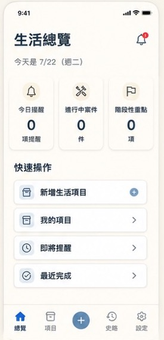 | 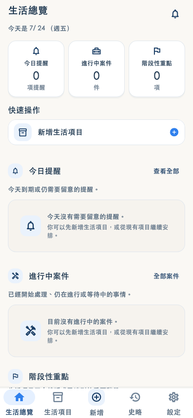 |

- 已對齊：暖白背景、20pt 級別頁標、日期、三張狀態卡、緊湊快速新增、白底輕邊框與低陰影。
- 已移除：大面積深藍 Hero、過高摘要卡與無意義留白。
- 邊界：參考圖的「我的項目／即將提醒／最近完成」已由正式首頁下方的 Drift 區塊承接；不新增無資料行為的假快捷列。

## 2. 生活項目

| 核准參考 | 當前 390×844 |
| --- | --- |
| 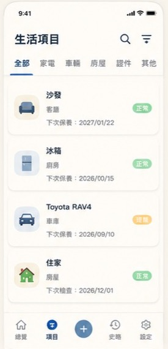 | 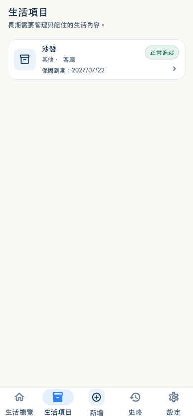 |

- 已對齊：無大 Icon 頁首、橫向緊湊項目卡、44pt Icon、名稱／分類／位置／日期層級、右側低壓力 Badge。
- 邊界：搜尋與分類篩選不是現有功能，本 PR 不加入無作用控制或擴大功能。

## 3. 新增生活項目－基本資料

| 核准參考 | 當前 390×844 |
| --- | --- |
| 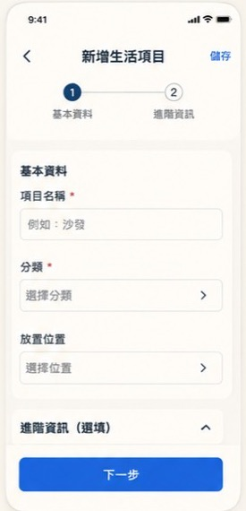 | 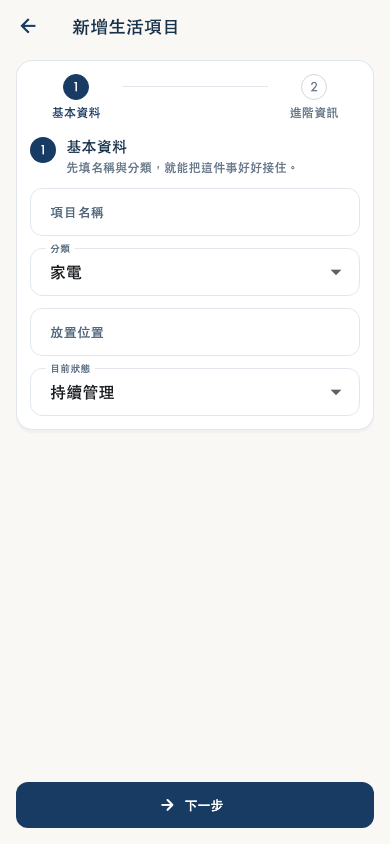 |

- 已對齊：精簡 AppBar、兩步指示、基本資料分區、名稱／分類／位置、固定底部主按鈕。
- 保留欄位：「目前狀態」是現有正式欄位，不得為了外觀刪除。

## 4. 新增生活項目－進階資訊

| 核准參考 | 當前 390×844 |
| --- | --- |
| 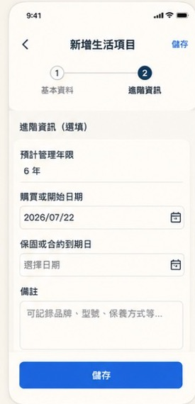 | 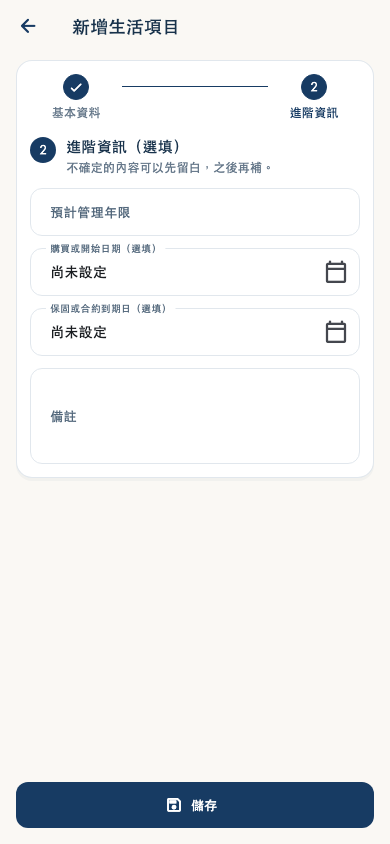 |

- 已對齊：第二步狀態、進階資訊卡、年限／購買日／到期日／備註、底部儲存。
- 資料契約：只切換呈現步驟；controller、validation、save transaction 與所有寫入欄位不變。

## 5. 項目詳情

| 核准參考 | 當前 390×844 |
| --- | --- |
| 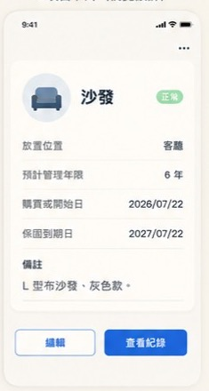 | 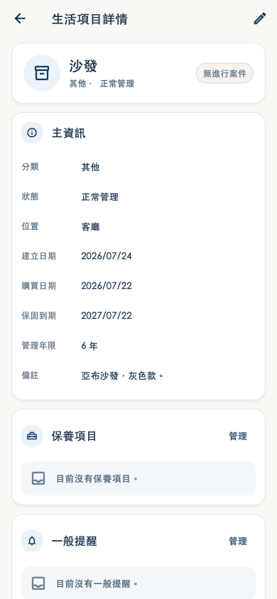 |

- 已對齊：白底項目摘要、圓形 Icon、名稱與狀態 Badge、主資訊提到首屏、屬性左右對齊。
- 保留正式內容：保養、提醒、排程、Milestone／大修、案件、史略與附件仍按原順序在主資訊後呈現。

## 6. 史略

| 核准視覺規格 | 當前 390×844 |
| --- | --- |
| 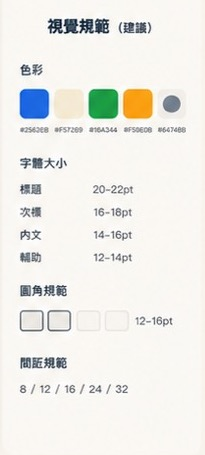 | 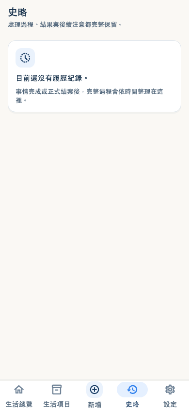 |

- 已對齊：20pt 頁標、14pt 內文、12pt 輔助、16pt 卡片圓角、8／12／16／24 間距與暖白空狀態。
- History 仍為唯讀投影，本 PR 沒有新增寫入流程。

## 7. 設定

| 核准視覺規格 | 當前 390×844 |
| --- | --- |
|  | 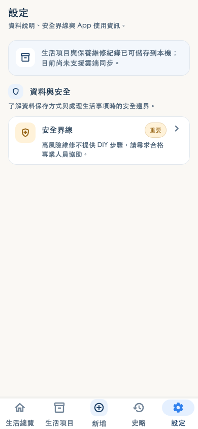 |

- 已對齊：無大 Icon 頁首、分組標題、iOS 式緊湊列、狀態 Badge、暖白背景與群組留白。

## 8. 目前 Gate 結論

- 核准參考圖、頁面裁切與當前渲染截圖已納入版本控制。
- 字級、密度、留白、卡片比例、配色與主操作層級已向核准圖收旂。
- 範例中沒有展示史略與設定完整頁，這兩頁依圖中視覺規格而不是自行新增風格。
- 尚未完成 USB 真機六頁原始截圖與董事長批准，因此 PR #242 必須維持 Draft，不得合併。
